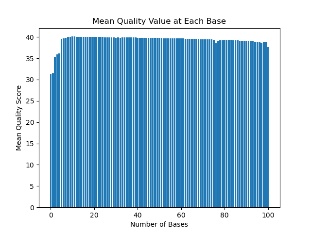
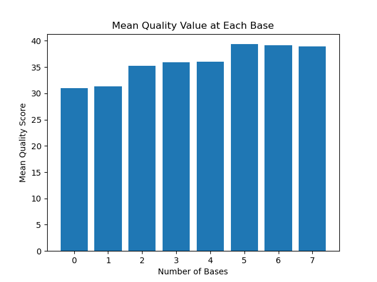
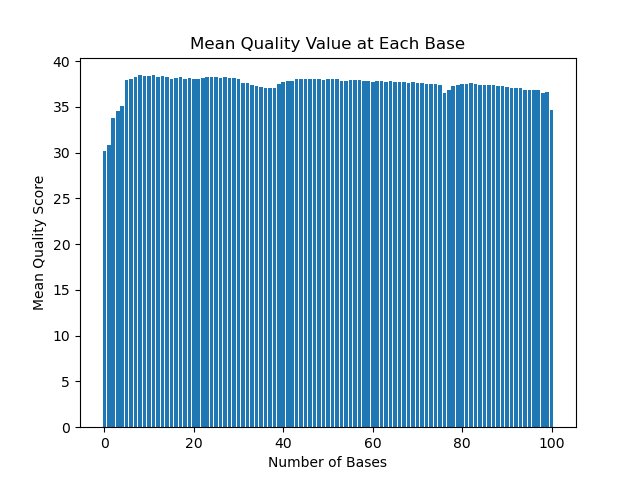

# Assignment the First

## Part 1
1. Be sure to upload your Python script. Provide a link to it here:

[mean_qual.py](mean_qual.py)

| File name | label | Read length | Phred encoding |
|---|---|---|---|
| 1294_S1_L008_R1_001.fastq.gz | read1 | 101 | Phred+33 |
| 1294_S1_L008_R2_001.fastq.gz | index1 | 8 | Phred+33 |
| 1294_S1_L008_R3_001.fastq.gz | index2 | 8 | Phred+33 |
| 1294_S1_L008_R4_001.fastq.gz | read2 | 101 | Phred+33 |

2. Per-base NT distribution
    1. Use markdown to insert your 4 histograms here.

    Run 1
    

    Run 2
    

    Run 3
    

    Run 4
    

    2. For the biological reads, I am not going to set a quality score cutoff.  The next step with that data is to align the genome, and the aligner that will be used should filter out any bad data, so the extra quality score threshold is unnecessary.

    For the indexes, I'm going to set a quality score threshold of 20.  At 20, that guarantees a 99% accuracy of all the bases.  I don't want to make the threshold too high, otherwise too much data will be lost, but at 20 there should be enough filtering to get generally "high quality" data.


    3. There are 3976613 indexes with N in R2
       
   ```$ zcat /projects/bgmp/shared/2017_sequencing/1294_S1_L008_R2_001.fastq.gz | sed -n '2~4p' | grep "N" | wc -l```

   There are 3328051 indexes with N in R3

   ```$ zcat /projects/bgmp/shared/2017_sequencing/1294_S1_L008_R3_001.fastq.gz | sed -n '2~4p' | grep "N" | wc -l```
    
## Part 2
1. Define the problem

Determine level of index swapping and undetermined index pairs by demultiplexing data from the 2017 cohort's library preps

2. Describe output

Parse through four fastq files (R1:forward read, R2:index 1, R3:index 2, R4:reverse read) and move records to appropriate outputs based on indexes:
    If indexes match each other AND match one in given list of 24 known indexes, move record to files for matched indexes: index_R1.fq, index_R2.fq
    If indexes are not found in the list of 24, move record to files for unknown indexes: unk_R1.fq, unk_R2.fq
    If indexes are in list of 24 but not matched to each other, move record to files for hopped indexes: hopped_R1.fq, hopped_R2.fq

3. Upload your [4 input FASTQ files](../TEST-input_FASTQ) and your [>=6 expected output FASTQ files](../TEST-output_FASTQ).

4. Pseudocode

Start by opening all four input files (R1, R2, R3, R4)

Read four lines (one record) from all files at the same time
    if the line is an empty string (end of file) then break

Reverse complement R3 (index 2) to match index 1. Indexes need to have the same sequence.  If they have different sequences, index hopping has occurred.

Next, edit the headers to include the sequence of the index-pair to the header of both reads in all fastq files

Check if index 1 AND index 2 are in the set of 24 known indexes

- If one or both are NOT in the known set, create a counter for unknown indexes (unknown += 1) and then add R1 record to unk_R1.fq and R4 record to unk_R2.fq

- If both ARE in the known set, check if the average q score of the record is above a given threshold (will be decided later)

- If the record does not have a q score above the threshold, return to the unknown path

- If the record does pass the q score threshold, check if the indexes are identical (should be easy to check bc reverse complement function at beginning will have them in the same direction)

- If the indexes are NOT identical, create a dictionary for hopped indexes and set a counter, then add R1 to hopped_R1.fq and R4 to hopped_R2.fq

- If the indexes ARE identical, create a dictionary for matched indexes and set a counter, then add R1 to index_R1.fq and R4 to index_R2.fq

Unless the line is an empty string, return to beginning of loop for each new record and continue the same process for all records in all 4 files

5. High level functions. For each function, be sure to include:
    1. Description/doc string
    2. Function headers (name and parameters)
    3. Test examples for individual functions
    4. Return statement

Functions:

def rev_comp(index 2: str) -> str:
    Takes index 2 (R3) and reverses it to be in the same direction as index 1 (R2)
    return reverse complement
Inuput: ATGCT
Expected Output: AGCAT

def edit_header(F1.header, F2.seq, F4.header, F3.seq: str) -> str:
    Adds the sequence of index 1 and index 2 to all header lines
    return edited header
Input: @ABC123
Expected output: @ABC123-AAAAAAA-TTTTTTTTT

def check_q(F2.qscores, F3.qscores, qscore threshold: bool) -> bool:
    Checks if the qscores are above a sufficient threshold
    return true or false
Input: 36, 32, 20
Expected output: True
